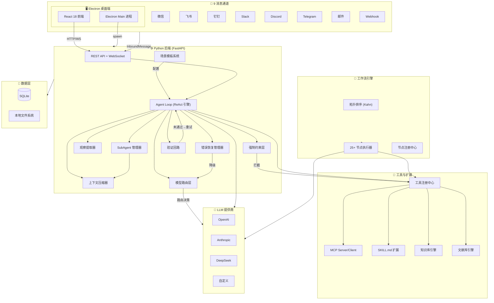

<div align="center">
  

  <h1>
    
  </h1>

  <p>
    <strong style="font-size: 1.2em; color: #FF6B35;">AI Agent 桌面框架 · 多agent 高效协作</strong>
  </p>

  <p>
    
    
    
  </p>

  <p>
    
    
    
    
  </p>
</div>

***

<div align="center">
  <h3>🌟 像大脑一样，深度思考，精准执行 🌟</h3>
</div>


***

## 🚀 5 分钟快速上手

```bash
# 1. 克隆 & 安装前端依赖
git clone https://github.com/Rvelamen/Cortex.git
cd Cortex && npm install

# 2. 安装后端 Python 依赖（Python 3.10+）
pip install -r backend/requirements.txt

# 3. 配置 API Key（任选一个）
#    打开应用 → 设置 → 模型提供商 → 添加 OpenAI/Anthropic/DeepSeek

# 4. 启动
npm run dev
```

**接下来做什么？**

| 场景 | 操作路径 | 预计耗时 |
| :-- | :-- | :-- |
| 搭一个智能客服 | 场景模板 → 智能客服 → 上传知识库 → 接入微信 | 5 分钟 |
| 做数据分析助手 | 场景模板 → 数据分析 → 上传 CSV → 运行 | 3 分钟 |
| 可视化工作流 | 工作流编辑器 → 拖拽节点 → 连线 → 运行 | 10 分钟 |
| 接入飞书/钉钉 | 设置 → 通道 → 扫码/配置 → 上线 | 3 分钟 |

> Docker 一键部署：`docker compose up -d`（详见下文 Docker 部署章节）

***

## 与同类产品对比

| 维度 | Cortex | Coze | Dify | LangFlow |
| :-- | :-- | :-- | :-- | :-- |
| 部署形态 | 桌面应用（本地优先） | 云端 SaaS | 云端/自部署 | 云端/自部署 |
| 数据存储 | 本地 SQLite | 云端 | 云端/PG | 云端/PG |
| 消息通道 | 9 通道（含微信/飞书/钉钉） | 有限 | API only | API only |
| 工作流引擎 | 25+ 节点 + Kahn 拓扑 | 简单编排 | 简单编排 | LangChain DAG |
| 多模型路由 | 任务分类 + 成本预算 + 熔断降级 | 手动选择 | 手动选择 | 手动选择 |
| 错误恢复 | 4 级降级链（重试→换模型→压缩→通知） | 无 | 无 | 无 |
| 场景模板 | 深度模板（含工作流建议） | 浅模板 | 无 | 无 |
| 扩展方式 | SKILL.md（Markdown 即可） | 插件市场 | API | Python 节点 |
| MCP 协议 | 双端（Server + Client） | 无 | 无 | 无 |
| 成本管控 | 实时 Token 看板 + 预算预警 | 有限 | 无 | 无 |

**Cortex 的差异化**：不是又一个云端 Agent 平台，而是**桌面级、数据本地、成本可控**的 AI Agent 编排框架。

***

## 一句话定位

> **Cortex 是一个桌面级 AI Agent 编排框架——让非技术用户 5 分钟搭建专属 AI 助手，支持 9 通道接入、可视化工作流、多模型智能路由，所有数据本地存储。**

## 三个核心场景

### 场景一：智能客服——从知识库到多渠道接入

```
用户上传文档 → 自动蒸馏训练 → 选择接入渠道 → 上线自动回复
     │              │              │              │
   PDF/Word      AI提取关键      微信/飞书       24/7运行
   /TXT/Excel    洞察入库        /钉钉/Web       按预算降级
```

**5 分钟部署**：选择「智能客服」模板 → 填写品牌名和知识库范围 → 上传文档 → 选择通道 → 上线。

### 场景二：数据分析——从 CSV 到洞察报告

```
上传CSV → 自动EDA → 异常检测 → 生成图表 → 编译报告 → 定时推送
    │         │          │          │          │          │
  自动识别   描述性统计   3σ+IQR    ECharts    结构化     邮件/飞书
  数据结构   分布分析    异常值     可视化     Markdown   定时投递
```

**5 分钟部署**：选择「数据分析助手」模板 → 设置分析深度 → 上传 CSV → 运行 → 查看报告。

### 场景三：多模型编排——成本与质量的动态平衡

```
用户请求 → 任务分类器 → 模型路由层 → LLM调用 → 成本记录
              │              │          │          │
         7种任务类型    成本预算检查   主模型     实时看板
         自动识别       熔断器保护    失败→降级   超支预警
```

**产品价值**：系统根据任务复杂度自动选择最优模型（简单对话→轻量模型，复杂分析→大模型），配合成本预算和熔断器，实现零停机服务。



***

## ✨ 核心特性

<table align="center">
<tr>
<td align="center" width="200px">

**🚀 一键部署**
*无需服务器、无需 YAML*

⚡ 双击安装运行
🐍 内置 Python 环境
💾 U 盘便携模式
🔒 数据本地保存

</td>
<td align="center" width="200px">

**💰 成本透明**
*每一分花费都心中有数*

📊 实时 Token 计数
📈 可视化费用图表
⚠️ 超支自动预警
🔄 模型成本对比

</td>
<td align="center" width="200px">

**🧩 Markdown 扩展**
*不写代码也能扩展*

📝 写 `SKILL.md`
🔗 MCP 协议支持
📦 Git 直接安装
♻️ 热更新支持

</td>
<td align="center" width="200px">

**🔄 可视化工作流**
*搭建 AI 流水线*

🎨 拖拽式编辑器
🧩 25+ 种节点类型
📋 版本管理
🔍 运行追踪调试

</td>
</tr>
<tr>
<td align="center" width="200px">

**🤖 可视化 SubAgent**
*创建专属 AI 助手*

🎨 图形界面创建
📁 工作区隔离
🎯 自动任务分发
🧠 独立配置记忆

</td>
<td align="center" width="200px">

**📚 知识库**
*你的第二大脑*

📄 多格式文档
📝 Markdown 笔记
💬 Notes Chat（限定范围 AI）
🧠 AI 智能蒸馏

</td>
<td align="center" width="200px">

**📡 多通道**
*随时随地聊天*

💬 桌面端 / 微信
🐦 Slack / Discord
✈️ Telegram / 钉钉
📧 邮件 / Webhook

</td>
<td align="center" width="200px">

**⏰ 智能定时任务**
*任务真正被执行*

▶️ SubAgent 真干活
📅 多种调度方式
💪 重启任务不丢
💬 访问上下文

</td>
</tr>
<tr>
<td align="center" width="200px">

**🗂️ 项目隔离**
*每个项目独立空间*

⚙️ 独立配置记忆
🔄 一键切换项目
👥 导出团队共享
💬 历史永不丢失

</td>
<td align="center" width="200px">

**🔊 文本转语音**
*让 AI 开口说话*

🗣️ 多种 TTS 引擎
🎵 自然语音输出
⚙️ 可自定义设置
📱 实时播放支持

</td>
<td align="center" width="200px">

**🧠 观察与记忆**
*从经验中学习*

🔍 9 种观察类型
📝 自动提取洞察
💾 提升为记忆
👤 用户画像追踪

</td>
<td align="center" width="200px">

**📄 多格式文件**
*读取任意文档*

📑 PDF / DOCX / XLSX
📊 PPTX 预览
🖼️ 图像理解
🧠 PDF 思维导图渲染

</td>
</tr>
</table>

***

## 🧭 智能模型路由层

不是手动选模型，而是系统根据任务类型和成本预算自动路由：

### 工作流程

```
用户请求
   │
   ▼
┌──────────────┐     ┌──────────────────┐
│  任务分类器    │────▶│   模型路由层      │
│  7种任务类型   │     │  成本预算检查      │
│  · SIMPLE_QA │     │  熔断器(3失败→60s)│
│  · COMPLEX   │     │  降级链构建        │
│  · CODE      │     └────────┬─────────┘
│  · MULTI_TURN│              │
│  · CREATIVE  │              ▼
│  · TOOL_USE  │     ┌──────────────────┐
│  · ANALYSIS  │     │   LLM 调用        │
└──────────────┘     │  主模型 → 降级模型  │
                     │  成本实时记录      │
                     └──────────────────┘
```

### 关键能力

| 能力 | 说明 |
| :-- | :-- |
| 任务自动分类 | 7 种任务类型，AI 自动识别请求复杂度 |
| 成本预算管控 | 日/月预算追踪，超支自动切换轻量模型 |
| 熔断器保护 | 单模型连续 3 次失败自动屏蔽 60 秒 |
| 降级链 | 主模型 → 备用模型 → 轻量模型，零停机 |
| 实时成本看板 | 按 provider/model 聚合，可视化趋势 |

> 代码位置：`backend/core/router/model_router.py`（720 行，45 个测试通过）

***

## 🛡️ 错误恢复机制

生产级 AI 系统的核心：不是不犯错，而是犯错后自动恢复。

### 4 级恢复链

```
错误发生
   │
   ▼
┌──────────────┐
│ 1. 重试       │ 指数退避 (1s → 2s → 4s)
│    失败↓     │
└──────┬───────┘
       │
       ▼
┌──────────────┐
│ 2. 模型降级   │ 切换到备用模型重试
│    失败↓     │
└──────┬───────┘
       │
       ▼
┌──────────────┐
│ 3. 上下文压缩 │ 裁剪历史消息，减小 token 消耗
│    失败↓     │
└──────┬───────┘
       │
       ▼
┌──────────────┐
│ 4. 用户通知   │ 通知冷却(5min)，防刷屏
└──────────────┘
```

| 能力 | 说明 |
| :-- | :-- |
| 自动重试 | 指数退避，可配置最大重试次数 |
| 模型降级 | 自动切换到更稳定/更轻量的模型 |
| 上下文压缩 | 超长对话自动裁剪，保留关键信息 |
| 用户通知 | 冷却机制避免频繁打扰，含错误历史记录 |
| 恢复统计 | 追踪各类恢复策略的命中率 |

> 代码位置：`backend/core/recovery/error_recovery.py`（403 行，17 个测试通过）

***

## 📋 场景模板系统

不是空白画布，而是从真实业务场景出发的深度模板：

### 模板一：智能客服

| 参数 | 说明 |
| :-- | :-- |
| 品牌名称 | 用于系统提示词个性化 |
| 知识库范围 | 限定 AI 回答的资料来源 |
| 回复语气 | 正式/亲切/专业 |
| 工作流建议 | 自动生成「文档检索 → 意图识别 → 回答」流程 |

### 模板二：数据分析助手

| 参数 | 说明 |
| :-- | :-- |
| 分析深度 | 描述性/诊断性/预测性 |
| 异常检测灵敏度 | 3σ / IQR / 自定义阈值 |
| 报告格式 | Markdown / HTML / PDF |
| 工作流建议 | 自动生成「EDA → 异常检测 → 图表生成 → 报告编译」流程 |

### 模板能力

- 系统提示词模板渲染（`{{param}}` 占位符）
- 参数验证与类型检查
- 工作流节点自动建议
- 完整 Agent 配置一键生成

> 代码位置：`backend/core/templates/scenario_templates.py`（471 行，34 个测试通过）

***

## 🛡️ 强制约束层（Action Hooks）

不是"建议"，而是"拦截"——在工具执行前强制检查，不通过则拒绝执行。

### 工作机制

```
Agent 决定调用工具
       │
       ▼
┌──────────────────┐
│  Pre-Hook 检查    │
│  · 危险命令拦截   │──→ BLOCK → 返回错误给 LLM
│  · 文件安全边界   │──→ BLOCK → 返回错误给 LLM
│  · Token 预算检查 │──→ BLOCK → 返回错误给 LLM
└────────┬─────────┘
         │ ALLOW
         ▼
┌──────────────────┐
│  工具执行         │
└────────┬─────────┘
         │
         ▼
┌──────────────────┐
│  Post-Hook 检查   │
│  · 用量记录       │
│  · 结果审计       │
└──────────────────┘
```

### 内置约束

| Hook | 拦截对象 | 说明 |
| :-- | :-- | :-- |
| DangerousCommandHook | shell/exec | 阻止 `rm -rf /`、`mkfs`、`dd of=/dev/sd`、fork bomb 等 13 类危险命令 |
| FileSafetyHook | write_file/edit_file | 阻止写入 workspace 外路径、覆盖 `.env`/`credentials.json`/`.pem` 等敏感文件 |
| TokenBudgetHook | llm/chat | 阻止超出 token 预算的 LLM 调用，实时追踪用量 |

### Hook 行为

| 行为 | 说明 |
| :-- | :-- |
| ALLOW | 放行执行 |
| BLOCK | 拒绝执行，返回错误信息给 LLM 重试 |
| MODIFY | 修改工具参数后放行 |
| WARN | 放行但记录警告 |

> 代码位置：`backend/core/hooks/action_hooks.py`（460 行，43 个测试通过）

***

## ✅ 验证回路（Verification Loop）

Agent 说"我做完了"之后，系统层面验证输出是否真的合格——不是信任 LLM 的自我报告。

### 验证链（按成本从低到高）

```
Agent 输出 "完成了"
       │
       ▼
┌──────────────────┐
│ 1. 结构检查       │ 空输出？错误文本？道歉句式？  ← O(1) 正则
│    失败↓         │
└────────┬─────────┘
         │ 通过
         ▼
┌──────────────────┐
│ 2. 完整性检查     │ 代码任务有代码块？研究任务有来源？  ← 关键词扫描
│    失败↓         │
└────────┬─────────┘
         │ 通过
         ▼
┌──────────────────┐
│ 3. 约束检查       │ 含占位符？超长？禁止内容？  ← 正则 + 长度
│    失败↓         │
└────────┬─────────┘
         │ 通过
         ▼
┌──────────────────┐
│ 4. 文件完整性     │ 声称修改的文件是否真的存在且非空？  ← 文件系统
│    失败↓         │
└────────┬─────────┘
         │ 通过
         ▼
    ✅ 任务完成
         │ 失败
         ▼
    🔄 注入反馈，重试（最多 2 轮）
```

### 任务类型与验证策略

| 任务类型 | 必需内容 | 验证策略 |
| :-- | :-- | :-- |
| CODE | 代码块 + 解释 | 检查 ` ``` ` 和 `def`/`class`/`import` |
| DOCUMENT | 摘要 + 细节 | 检查"总结/概述"和"详细/具体"标记 |
| DATA | 数据 + 分析 | 检查表格标记和"分析/趋势"关键词 |
| RESEARCH | 发现 + 来源 | 检查"发现/结果"和"http/来源/引用" |
| GENERAL | 无强制 | 跳过完整性检查 |

### 关键能力

| 能力 | 说明 |
| :-- | :-- |
| 自动任务分类 | 7 种任务类型启发式识别 |
| 短路机制 | error 级别失败立即停止，不再跑后续检查 |
| 反馈注入 | 失败时生成 `[VERIFICATION FEEDBACK]` 注入下一轮 |
| 重试上限 | 默认 2 轮，可配置 |
| 文件完整性 | 检查声称修改的文件是否真实存在 |

> 代码位置：`backend/core/verification/verification_loop.py`（528 行，42 个测试通过）

***

## 🔄 可视化工作流

基于 ReactFlow 的拖拽式编辑器，轻松构建复杂 AI 流水线：

### 节点类型（25+ 种）

| 分类       | 节点                                                             |
| :------- | :----------------------------------------------------------- |
| **流程**   | 工作流开始、回答节点、工作流结束                                            |
| **AI**    | LLM、问题分类器、内容提取器                                             |
| **工具**   | HTTP 请求、代码执行、读取文件、JSON 序列化/反序列化、文本编辑器                       |
| **逻辑**   | 条件分支、变量更新、循环、并行执行                                           |
| **交互**   | 用户选择、表单输入、输入节点、插件输出                                         |
| **Agent** | Agent 节点、子工作流                                               |

### 核心能力

- **可视化编辑器**：拖拽画布，自动布局
- **节点测试**：独立测试单个节点，运行前验证
- **版本管理**：保存、对比、恢复工作流版本
- **运行追踪**：逐步执行追踪，变量检查
- **循环支持**：嵌套循环节点，独立内部画布
- **模板**：预置常用模板（简单对话、条件分支）
- **自动保存**：5 秒防抖，脏状态指示器

***

## 📚 知识库

完整的知识管理系统，AI 驱动：

### 文档管理

- **多格式上传**：PDF、DOCX、XLSX、PPTX、图片等
- **分块上传**：>2MB 文件自动按 2MB 分块（最大 500MB）
- **AI 蒸馏**：使用 AI 从文档中提取关键洞察
- **批量操作**：批量蒸馏、移动、管理文档
- **预览**：应用内预览所有支持格式
- **导入/导出**：ZIP 导入/导出，Obsidian vault 导入

### 笔记

- **Markdown 编辑器**：全功能编辑器，支持 wiki-link 导航
- **Vault 系统**：创建和管理多个知识库
- **Obsidian 兼容**：导入已有 Obsidian vault

### Notes Chat

用专属 AI 代理与你的知识库对话：

- **限定范围**：可按路径或 vault 限定 Agent 访问范围，让对话更聚焦
- **会话持久化**：按 scope 维度保存历史，可随时继续
- **可配置 Agent**：复用任意已注册的 SubAgent 配置（模型、工具、系统提示）
- **内置知识库工具**：全文检索、笔记读取、链接列表、时间线遍历
- **记忆联动**：可选写入长期记忆与时间线观察
- **WebSocket 流式**：实时 token 流式输出，可见工具调用过程

### Library Chat Drawer

知识库内可调宽度的聊天侧拉面板，原地问答不打断阅读：

- **拖拽调宽**：抽屉宽度可自由调整
- **会话列表**：快速切换历史会话
- **Markdown + KaTeX**：回复中支持公式与代码高亮
- **流式体验**：实时输出，附一键复制

### 知识图谱

- **可视化探索**：基于 PixiJS 的 WebGL 图谱渲染
- **力导向布局**：交互式节点定位
- **关系映射**：发现知识节点之间的关联

### PDF 思维导图

把任意 PDF 一键变可导航的思维导图：

- **大纲抽取**：解析 PDF 书签/标题为树形结构
- **交互渲染**：支持平移、缩放、折叠/展开
- **独立窗口**：可在 Electron 中单独打开 PDF 阅读器
- **内联批注**：阅读时高亮、下划线标注
- **PDF AI 问答**：基于当前文档内容回答问题

***

## 📡 多通道支持

将 Cortex 连接到你常用的平台：

| 通道       | 功能                                  |
| :------- | :---------------------------------- |
| 🖥️ 桌面端  | 全功能原生应用，WebSocket 实时通信             |
| 💬 微信    | 扫码登录、收发消息、自动回复                      |
| 🐦 Slack | Bolt SDK 集成、频道和私信支持                |
| 🎮 Discord | Bot 集成、服务器和频道消息                   |
| ✈️ Telegram | Bot API、聊天和群组支持                   |
| 📱 钉钉    | Stream 协议、会话消息                      |
| 📧 邮件    | SMTP/IMAP 集成                        |
| 🔗 Webhook | 通用 HTTP Webhook，自定义集成             |
| 🐦 飞书    | Lark SDK、事件订阅                       |

***

## 🔌 扩展生态

### 技能扩展（Markdown 即可）

写一个 `SKILL.md` 就能让 AI 学会新能力：

```markdown
---
name: "代码审查"
emoji: "🔍"
---

审查代码时检查：
1. 安全问题（SQL 注入、XSS）
2. 性能瓶颈
3. 命名规范
```

放入 `workspace/extensions/my-skill/SKILL.md`，重启即生效。

### 扩展市场

- 浏览和安装社区扩展
- 三种扩展类型：**Skill**、**Plugin**、**Worker**
- 搜索、按类型筛选、按热度排序
- 一键安装，支持环境变量配置

### MCP 协议支持

- 连接任意 MCP 服务器（stdio / HTTP SSE）
- 自动发现工具，无需手动配置
- 可视化权限管理，按工具启用/禁用
- 实时连接状态监控

***

## 🛠️ 内置工具

| 类别       | 工具                                               | 说明            |
| :------- | :----------------------------------------------- | :------------ |
| 📁 文件系统  | `read`, `write`, `edit`, `list`                  | 文件读写操作        |
| 🖥️ 系统   | `shell`, `spawn`                                 | 命令行执行         |
| 🌐 网络    | `web_fetch`                                      | 网页内容抓取        |
| 🖥️ 浏览器  | `browser_navigate`, `browser_click`, `browser_screenshot`, ... | Playwright 浏览器自动化 |
| 🖼️ 图像   | `image_understand`, `image_generate`             | AI 图像处理       |
| ⏰ 定时     | `cron_add`, `cron_list`, `cron_remove`           | 定时任务管理        |
| 💬 消息    | `send_message`                                   | 多通道消息发送       |
| 🧠 记忆    | `memory_read`, `memory_write`                    | Agent 记忆操作     |
| 📚 知识库   | `knowledge_search`, `knowledge_query`            | 知识库检索         |
| ⚡ 动作     | `action`                                         | 执行扩展动作        |

***

## 🧠 观察与记忆

Cortex 自动从对话中提取洞察：

### 观察类型

| 类型             | 说明              |
| :------------- | :-------------- |
| 🎯 关键发现        | 重要的发现和顿悟时刻      |
| 🔧 问题-方案       | 问题和解决方案配对       |
| ⚙️ 工作原理        | 某事物如何运作的解释      |
| 📝 变更记录        | 变更追踪            |
| 🔍 新发现         | 新的发现            |
| ❓ 存在原因        | 设计理由和原因         |
| 📋 决策          | 设计决策            |
| ⚖️ 权衡分析       | 权衡分析            |
| 💡 通用观察        | 通用观察记录          |

### 记忆功能

- **自动提取**：AI 自动识别和提取对话中的观察
- **提升为记忆**：将重要观察提升为长期记忆
- **用户画像**：追踪用户偏好和行为模式
- **上下文深度**：查看观察及其周围对话上下文

***

## ⚙️ 可视化配置

所有配置都有图形界面，不用写 YAML：

| 配置项       | 说明                                           |
| :-------- | :------------------------------------------- |
| **模型提供商** | 添加 OpenAI/Anthropic/DeepSeek 等，支持多提供商切换      |
| **Agent 设置** | 模型、最大 Token、温度、最大迭代、压缩配置                  |
| **通道配置**  | 微信扫码登录、Telegram Bot、Slack App、钉钉等            |
| **工具开关**  | 一键启用/禁用工具，设置超时时间                             |
| **工作目录**  | 独立工作区，配置和记忆完全隔离                              |
| **预算上限**  | 设置月度 Token 上限，超支提醒                           |
| **多模态**   | 图像理解、TTS 等多模态设置                              |

***

## 💰 Token 消耗可视化

实时监控每一次对话的成本：

- 📊 **实时统计**：输入/输出 Token、缓存命中、补全 Token、子 Agent 用量
- 📈 **历史趋势**：按天查看消耗走势（7/14/30 天）
- 📋 **分类明细**：按提供商和模型分析成本
- ⚠️ **预算告警**：设置上限，超支自动提醒

***

## ⏰ 智能定时任务

不只是定时发通知，而是真干活：

- **SubAgent 执行**：任务在独立 Agent 中运行，真正执行操作
- **灵活调度**：支持 ISO 时间、间隔秒数、Cron 表达式
- **上下文继承**：任务可以访问创建时的会话记忆
- **持久化存储**：任务保存在 SQLite，重启不丢失
- **通道投递**：将任务结果发送到指定通道

***

## 🗂️ 工作目录管理

每个项目一个工作区，互不干扰：

```
workspace/
├── project-a/          # 项目 A
│   ├── extensions/     # 专属扩展
│   ├── memory/         # 长期记忆
│   └── history/        # 聊天记录
├── project-b/          # 项目 B
│   └── ...
```

- 切换工作区 = 切换完整的配置和记忆
- 支持导出/导入工作区
- 团队共享：导出工作区，同事导入即用
- 内置文件浏览器，集成 Monaco Editor
- 多格式预览：PDF、DOCX、XLSX、PPTX、图片、Markdown

***

## 💬 聊天历史记录

- 所有对话保存在本地 SQLite
- 三级组织结构：通道 → 会话 → 实例
- 按消息类型筛选，跨历史搜索
- 可随时回到任意历史会话
- 支持多会话并行

***

## 🤖 可视化 SubAgent

通过界面创建和管理专用 Agent：

- **可视化编辑**：修改 `SOUL.md` 配置角色、工具、模型
- **一键创建**：填写名称自动生成模板配置
- **独立工作区**：每个 SubAgent 有自己的配置和记忆
- **主从调度**：主 Agent 自动调用合适的 SubAgent 处理任务
- **工具与扩展绑定**：为每个 Agent 分配特定工具和扩展

***

## 🛠️ 开发环境

### 环境要求

- **Node.js** >= 18
- **Python** >= 3.10

### 安装启动

```bash
# 1. 克隆项目
git clone https://github.com/Rvelamen/Cortex.git
cd Cortex

# 2. 安装前端依赖
npm install

# 3. 安装后端 Python 依赖（Python 3.10+）
pip install -r backend/requirements.txt

# 4. 启动开发模式
npm run dev
```

> 💡 `npm run dev` 会同时启动：
>
> - 前端开发服务器 (<http://localhost:3000>)
> - Electron 桌面应用窗口
> - Python 后端（由 Electron 自动启动）

***

## 📦 构建发布

### 开发命令

| 命令                     | 说明                  |
| :--------------------- | :------------------ |
| `npm run dev`          | 开发模式（前端 + Electron） |
| `npm run dev:frontend` | 仅启动前端开发服务器          |
| `npm run dev:electron` | 仅启动 Electron        |

### 构建命令

| 命令                       | 说明                  |
| :----------------------- | :------------------ |
| `npm run build:frontend` | 构建 React 前端         |
| `npm run build:python`   | 打包 Python 后端        |
| `npm run build`          | 完整构建（前端 + Electron） |

### 打包发布

| 命令                 | 说明         | 输出格式                          |
| :----------------- | :--------- | :---------------------------- |
| `npm run dist`     | 当前平台打包     | 根据平台自动选择                      |
| `npm run dist:mac` | macOS 打包   | DMG + ZIP（通用二进制：x64/arm64）    |
| `npm run dist:win` | Windows 打包 | NSIS 安装包 + 便携版                |
| `npm run dist:linux` | Linux 打包 | AppImage + DEB 安装包               |

> 📂 输出目录：`dist-electron/`
> 📖 详细构建指南：[README\_BUILD.md](./README_BUILD.md)

***

## 🏗️ 项目架构

```
cortex/
├── agents/                 🧠 AI Agent 工作区
│   ├── code-reviewer/      代码审查 Agent
│   ├── common/             通用 Agent 模板
│   └── system/             系统 Agent 配置
│       └── avatars/        Agent 头像资源
├── backend/                ⚡ Python 后端
│   ├── agent/              Agent 核心逻辑
│   │   ├── processors/     流式/非流式/长任务处理器
│   │   ├── compressor.py   上下文压缩
│   │   ├── subagent.py     SubAgent 调度（含 ReAct 同步日志）
│   │   ├── notes_chat_agent.py Notes Chat 限定范围 Agent
│   │   └── observation_*.py 观察提取与管理
│   ├── api/                FastAPI 服务接口
│   ├── channels/           多通道支持
│   │   ├── desktop/        桌面端通道（WebSocket）
│   │   ├── wechat/         微信通道
│   │   ├── feishu/         飞书通道
│   │   ├── dingtalk/       钉钉通道
│   │   ├── slack/          Slack 通道
│   │   ├── discord/        Discord 通道
│   │   ├── telegram/       Telegram 通道
│   │   ├── email/          邮件通道
│   │   └── webhook/        Webhook 通道
│   ├── core/               核心模块
│   │   ├── config/         配置与 Schema
│   │   ├── events/         事件总线系统
│   │   ├── longtask/       长任务管理
│   │   ├── models/         数据模型
│   │   ├── providers/      LLM 提供商适配器（OpenAI/Anthropic）
│   │   ├── router/         模型路由层（任务分类+成本预算+熔断降级）
│   │   ├── recovery/       错误恢复机制（4级降级链）
│   │   ├── hooks/          强制约束层（危险命令拦截+文件安全+预算控制）
│   │   ├── verification/   验证回路（输出自检+重试反馈注入）
│   │   └── templates/      场景模板系统（智能客服+数据分析）
│   ├── data/               数据存储（SQLite）
│   │   ├── migrations/     数据库迁移（22 个迁移）
│   │   └── schema/         数据模式（agent/session/token/workflow/...）
│   ├── extensions/         插件系统
│   │   ├── builtin/        内置扩展（cron 等）
│   │   └── loader.py       动态扩展加载器
│   ├── mcp/                MCP 协议集成
│   │   ├── server/         MCP 服务器连接与工具注册
│   │   └── llm_bridge.py   LLM-MCP 桥接
│   ├── services/           服务层
│   │   ├── cron/           定时任务服务
│   │   ├── tts/            文本转语音（OpenAI/MiMo 引擎）
│   │   ├── workflow/       工作流引擎与执行器
│   │   ├── knowledge_*.py  知识库服务
│   │   ├── knowledge_task_worker.py 蒸馏任务 Worker（含 ReAct 日志）
│   │   ├── notes_chat_service.py    Notes Chat 会话/消息服务
│   │   ├── image_service.py 图像生成服务
│   │   ├── analytics_service.py Agent 成本分析服务
│   │   └── llm_service.py  LLM 调用服务
│   ├── tools/              内置工具集
│   │   ├── filesystem.py   文件系统工具
│   │   ├── shell.py        命令行工具
│   │   ├── web_fetch.py    网络抓取工具
│   │   ├── browser/        Playwright 浏览器自动化
│   │   ├── image.py        图像处理工具
│   │   ├── cron.py         定时任务工具
│   │   ├── message.py      消息发送工具
│   │   ├── memory.py       记忆读取工具
│   │   ├── memory_write.py 记忆写入工具
│   │   ├── knowledge.py    知识库工具
│   │   ├── action.py       扩展动作工具
│   │   └── spawn.py        进程启动工具
│   └── utils/              工具函数
├── electron/               🖥️ Electron 主进程
│   ├── main.js             主进程入口（Python 生命周期、窗口管理）
│   └── preload.js          预加载脚本（IPC 桥接）
├── frontend/               🎨 React 前端
│   ├── src/
│   │   ├── pages/          页面组件
│   │   │   ├── Chat/       聊天界面（流式输出与工具展示）
│   │   │   ├── Config/     设置（提供商/Agent/通道/多模态）
│   │   │   ├── Workflow/   可视化工作流编辑器（ReactFlow）
│   │   │   ├── Knowledge/  知识库（文档/笔记/图谱）
│   │   │   │   ├── library/LibraryChatDrawer  库内聊天抽屉
│   │   │   │   └── hooks/  知识库 Hooks（useNotesChat、useChat、useChatDrawer）
│   │   │   ├── PdfViewerWindow 独立 PDF 阅读器（含思维导图）
│   │   │   ├── Agents/     SubAgent 管理
│   │   │   ├── MCP/        MCP 服务器与工具管理
│   │   │   ├── Extensions/ 扩展市场
│   │   │   ├── Cron/       定时任务
│   │   │   ├── Tokens/     Token 用量仪表盘
│   │   │   ├── History/    聊天历史浏览器
│   │   │   ├── Memory/     观察与记忆查看器
│   │   │   └── Workspace/  文件浏览器与编辑器
│   │   ├── components/     共享组件
│   │   │   ├── MessageList/ 消息渲染（迭代折叠）
│   │   │   ├── TTSPlayer/  音频播放
│   │   │   ├── TaskIndicator/ 任务状态指示器
│   │   │   ├── MermaidDiagram/ Mermaid 图表渲染
│   │   │   └── MindmapDiagram/   PDF 思维导图（react-d3-tree）
│   │   ├── workflow/       工作流引擎
│   │   │   ├── components/ 节点组件（25+ 种已注册类型）
│   │   │   ├── hooks/      Zustand 工作流状态管理
│   │   │   ├── types/      类型定义
│   │   │   └── templates/  工作流模板
│   │   ├── contexts/       React 上下文（WebSocket、蒸馏任务）
│   │   ├── hooks/          自定义 Hooks（useChatState、useMermaid）
│   │   └── utils/          工具函数
│   └── package.json
├── build/                  🔧 构建资源（图标等）
├── workspace/              📂 工作区数据（运行时生成，git-ignored）
├── build_python.py         🐍 Python 打包脚本（PyInstaller）
├── tests/                  🧪 单元测试（273 个测试）
│   ├── test_model_router.py      模型路由层测试（45个）
│   ├── test_error_recovery.py    错误恢复测试（17个）
│   ├── test_scenario_templates.py 场景模板测试（34个）
│   ├── test_verification_loop.py  验证回路测试（42个）
│   ├── test_action_hooks.py       强制约束测试（43个）
│   ├── test_workflow_engine.py   工作流引擎测试（25个）
│   ├── test_analytics_service.py  分析服务测试（24个）
│   ├── test_compressor.py        上下文压缩测试（20个）
│   ├── test_browser_tool.py      浏览器自动化测试（15个）
│   └── test_subagent.py          子代理调度测试（8个）
├── benchmarks/             📈 性能基准测试
│   └── benchmark_core.py         核心算法基准（4类）
├── Dockerfile              🐳 多阶段构建
├── docker-compose.yml      🐳 容器编排
├── .github/workflows/      🔧 CI/CD（lint+test+build）
├── package.json            📋 项目配置和脚本
└── README.md               📖 项目说明
```

### 技术栈

| 层级     | 技术                      | 说明             |
| :----- | :---------------------- | :------------- |
| **前端** | React 18 + Vite 5       | 现代化 UI 框架      |
|        | Ant Design 6            | 组件库            |
|        | ReactFlow               | 可视化工作流编辑器      |
|        | Monaco Editor           | 代码编辑器          |
|        | ECharts 6               | 数据可视化          |
|        | PixiJS                  | 知识图谱 WebGL 渲染  |
|        | react-d3-tree           | PDF 思维导图渲染     |
|        | Zustand                 | 工作流状态管理        |
| **后端** | Python 3.10+ + FastAPI  | 高性能异步 Web 服务   |
|        | SQLite + SQLAlchemy     | 本地轻量数据库        |
|        | Playwright              | 浏览器自动化         |
|        | APScheduler             | 任务调度           |
| **桌面** | Electron 28             | 跨平台桌面应用框架     |
|        | electron-builder        | 应用打包工具         |

### 运行时架构

```
┌─────────────────────────────────────────────┐
│              Electron 主进程                   │
│  ┌──────────────────┐  ┌─────────────────┐  │
│  │  BrowserWindow   │  │ Python 子进程     │  │
│  │  (React SPA)     │  │ (cortex-server) │  │
│  │                  │  │                  │  │
│  │  electronAPI ────┼──┼──▶ FastAPI       │  │
│  │  (preload 桥接)   │  │    (WebSocket)   │  │
│  └──────────────────┘  └─────────────────┘  │
└─────────────────────────────────────────────┘
```

- **通信方式**：前端与后端全 WebSocket 通信
- **请求-响应**：基于 `request_id` 的关联与超时机制
- **事件订阅**：发布/订阅模式处理实时事件
- **Python 生命周期**：由 Electron 管理（自动启停）

***

## 🔧 模型配置

在应用设置面板中添加 API 密钥即可使用：

### 支持的提供商

| 提供商       | 代表模型                                           |
| :-------- | :--------------------------------------------- |
| OpenAI    | GPT-4o, GPT-4 Turbo, GPT-3.5 Turbo, o1        |
| Anthropic | Claude 3 Opus, Claude 3 Sonnet, Claude 3 Haiku |
| Google    | Gemini Pro, Gemini Ultra                       |
| DeepSeek  | DeepSeek Chat, DeepSeek Coder                  |
| 阿里云       | 通义千问系列                                         |
| 百度        | 文心一言系列                                         |
| 自定义       | 任意 OpenAI 兼容 API 端点                            |

### 配置步骤

1. 打开应用 → 设置 → 模型提供商
2. 添加提供商（选择或自定义）
3. 输入 API Key 和 Base URL
4. 选择要使用的模型
5. 保存并开始使用

***

## 🔌 MCP 协议

Cortex 完整支持 **Model Context Protocol (MCP)**：

- 🔗 连接任意 MCP 服务器
- 🛠️ 使用 MCP 提供的工具
- 🔐 安全的权限管理
- 🔄 实时连接状态监控
- 📋 可视化服务器管理（添加/编辑/删除/重连）
- 🔍 自动发现工具，按工具启用/禁用

### 支持的传输协议

- **stdio**：本地进程通信
- **HTTP SSE**：基于 HTTP 的 Server-Sent Events

***

## 🤖 Agent 工作区

Agent 系统支持持续记忆和个性化配置：

### 配置文件

| 文件                     | 用途                   |
| :--------------------- | :------------------- |
| `SOUL.md`              | Agent 灵魂 - 核心准则和性格定义 |
| `IDENTITY.md`          | Agent 身份 - 自我介绍      |
| `AGENTS.md`            | 工作区指南 - 使用说明         |
| `MEMORY.md`            | 长期记忆 - 重要信息持久化       |
| `memory/YYYY-MM-DD.md` | 每日笔记 - 当天事件记录        |

### 创建自定义 Agent

在 `agents/` 目录下创建新文件夹，添加配置文件即可创建专属 Agent。

***

## 📂 项目结构

```
cortex/
├── backend/              # Python 后端（FastAPI）
├── frontend/             # React 前端（Vite）
├── electron/             # Electron 主进程
├── build/                # 构建资源（图标等）
├── build_python.py       # Python 打包脚本
├── workspace/            # ⚠️ 运行时生成目录（git-ignored）
│   ├── agents/           #   - 用户创建的 Agent 配置
│   ├── extensions/       #   - 已安装的扩展
│   ├── files/            #   - 工作区文件
│   ├── images/           #   - 生成的图片
│   └── ...               #   - 其他运行时数据
└── scripts/              # 辅助脚本
```

> **注意**：`workspace/` 目录在运行时创建，包含用户数据、Agent 配置和生成文件。通过 `.gitignore` 排除在版本控制之外。

***

## 📖 文档导航

- 📘 [构建指南](./README_BUILD.md) - 打包发布详细说明
- 📗 [Agent 指南](./agents/system/AGENTS.md) - Agent 工作区使用
- 📕 [身份设定](./agents/system/IDENTITY.md) - 了解 Cortex 是谁
- 🧠 [灵魂内核](./agents/system/SOUL.md) - Agent 核心准则
- 🔌 [MCP 文档](./backend/mcp/README.md) - MCP 协议集成详解
- 🌐 [浏览器工具](./backend/tools/browser/README.md) - 浏览器自动化指南

***

## 🤝 参与贡献

欢迎提交 Issue 和 Pull Request：

- 🐛 报告 Bug
- ✨ 提交新功能
- 📝 改进文档
- 🎨 优化 UI/UX

***

## 🐳 Docker 部署

```bash
# 一键启动（backend + frontend）
docker compose up -d

# 访问
# 前端: http://localhost:3000
# 后端: http://localhost:8000
```

| 服务 | 端口 | 说明 |
| :-- | :-- | :-- |
| frontend | 3000 | React 前端 |
| backend | 8000 | FastAPI 后端 |

> Dockerfile 使用多阶段构建，最终镜像 < 500MB。

***

## 🗺️ 产品路线图

### 已完成

- [x] 核心 Agent 引擎（ReAct 循环 + 流式处理）
- [x] SubAgent 调度（同步/异步双模式）
- [x] 三级上下文压缩
- [x] 可视化工作流引擎（25+ 种节点 + Kahn 拓扑排序）
- [x] 9 通道接入（微信/飞书/钉钉/Slack/Discord/Telegram/邮件/Webhook/桌面端）
- [x] MCP 协议双端（Server + Client）
- [x] 知识库系统（文档/笔记/图谱/蒸馏）
- [x] Agent Analytics Service（成本聚合 + 优化建议 + Dashboard）
- [x] 多模型路由层（任务分类 + 成本预算 + 熔断降级）
- [x] 错误恢复机制（4 级降级链）
- [x] 场景模板系统（智能客服 + 数据分析）
- [x] Docker 部署 + CI/CD
- [x] 性能 Benchmark 脚本
- [x] 验证回路（4 级验证链 + 任务分类 + 重试反馈注入）
- [x] 强制约束层（危险命令拦截 + 文件安全 + Token 预算）
- [x] 三类 SKILL.md 方法论模板（清单型 + 工作流型 + 领域专家型）

### 进行中

- [ ] 更多场景模板（项目管理、内容创作、代码审查）
- [ ] 模型路由层 A/B 测试框架
- [ ] 前端可视化路由策略编辑器

### 规划中

- [ ] 团队协作模式（多用户共享工作区）
- [ ] 插件市场开放生态
- [ ] 本地模型支持（Ollama / llama.cpp）
- [ ] 语音对话模式（STT + TTS 闭环）

***

## 📋 更新日志

### 2026-08

| 日期         | 版本     | 更新内容                                    |
| :--------- | :----- | :-------------------------------------- |
| 2026-08-18 | v1.1.0 | 🧭 新增：智能模型路由层（任务分类 + 成本预算 + 熔断降级）       |
| 2026-08-18 | v1.1.0 | 🛡️ 新增：错误恢复机制（4 级降级链：重试→换模型→压缩→通知）   |
| 2026-08-18 | v1.1.0 | 📋 新增：场景模板系统（智能客服 + 数据分析助手）             |
| 2026-08-18 | v1.1.0 | 📊 新增：Agent Analytics Service（成本聚合 + 优化建议） |
| 2026-08-18 | v1.1.0 | 🐳 新增：Docker 多阶段构建 + docker-compose 部署    |
| 2026-08-18 | v1.1.0 | 🔧 新增：CI/CD（lint + test + build 三 job）   |
| 2026-08-18 | v1.1.0 | 📈 新增：性能 Benchmark 脚本（4 类算法基准测试）        |
| 2026-08-18 | v1.1.0 | ✅ 新增：验证回路（4 级验证链 + 任务分类 + 重试反馈注入）     |
| 2026-08-18 | v1.1.0 | 🛡️ 新增：强制约束层（危险命令拦截 + 文件安全 + Token 预算）   |
| 2026-08-18 | v1.1.0 | 📝 新增：3 类 SKILL.md 方法论模板（清单/工作流/领域专家）   |
| 2026-08-18 | v1.1.0 | 🧪 新增：单元测试 273 个（路由 45 + 恢复 17 + 模板 34 + 验证 42 + 约束 43 + 引擎 25 + 分析 24 + 压缩 20 + 浏览器 15 + 子代理 8） |
| 2026-08-18 | v1.1.0 | 📖 优化：README 产品化重写（快速上手 + 竞品对比 + 路线图）   |
| 2026-08-17 | v1.1.0 | 🔧 修复：全局重命名 Octopus → Cortex（代码、文档、资源） |

### 2026-06

| 日期         | 版本     | 更新内容                                    |
| :--------- | :----- | :-------------------------------------- |
| 2026-06-06 | v1.1.0 | 💬 新增：Notes Chat — 限定范围的笔记对话 AI 代理       |
| 2026-06-06 | v1.1.0 | 📚 新增：Library Chat Drawer — 库内可调宽度的聊天抽屉    |
| 2026-06-06 | v1.1.0 | 🧠 新增：PDF 思维导图渲染（react-d3-tree）           |
| 2026-06-06 | v1.1.0 | 📄 新增：独立 PDF 阅读器窗口（标注 + 问答）             |
| 2026-06-06 | v1.1.0 | 🐧 新增：Linux 打包支持（AppImage + DEB）          |
| 2026-06-06 | v1.1.0 | 🔧 优化：SubAgent / 蒸馏任务 ReAct 执行日志           |
| 2026-06-06 | v1.1.0 | 🧹 清理：移除遗留的 pixel-theme 备份文件               |

### 2026-05

| 日期         | 版本     | 更新内容                                  |
| :--------- | :----- | :------------------------------------ |
| 2026-05-17 | v1.0.0 | 🔄 新增：可视化工作流编辑器，25+ 种节点类型              |
| 2026-05-17 | v1.0.0 | 📚 新增：知识库系统（文档/笔记/图谱）                 |
| 2026-05-17 | v1.0.0 | 📡 新增：多通道支持（Slack/Discord/Telegram/...） |
| 2026-05-17 | v1.0.0 | 🌐 新增：Playwright 浏览器自动化工具             |
| 2026-05-17 | v1.0.0 | 🧠 新增：观察与记忆系统                          |

### 2026-03

| 日期         | 版本     | 更新内容                        |
| :--------- | :----- | :-------------------------- |
| 2026-03-29 | v1.0.0 | 🔊 新增：文本转语音 (TTS) 功能支持      |
| 2026-03-29 | v1.0.0 | 🤖 新增：子代理管理功能及 UI 改进        |
| 2026-03-28 | v1.0.0 | 🗜️ 新增：对话上下文压缩及 LLM 重试优化    |
| 2026-03-25 | v1.0.0 | 📄 新增：PDF、DOCX 和 Excel 文件支持 |
| 2026-03-24 | v1.0.0 | 💬 新增：微信通道，支持扫码登录和消息收发      |
| 2026-03-22 | v1.0.0 | 🖼️ 新增：无边框窗口支持              |
| 2026-03-20 | v1.0.0 | 🎉 发布：项目更名为 Cortex         |

***

<div align="center">

### 🧠 Cortex，让你的工作更高效 🧠


<sub>Built with ❤️ and 🧠</sub>

</div>
